# ScanHippoHealth 🧠💊

<div align="center">
  
</div>


ScanHippoHealth is a sophisticated MRI segmentation project specifically designed for the segmentation of the Hippocampus. The project utilizes the dataset provided by the [Medical Segmentation Decathlon](http://medicaldecathlon.com/) for Generalizable 3D Semantic Segmentation.

## Overview

The project employs a 3D-Unet architecture for accurate segmentation. The architecture diagram can be found below- 

<div align="center">
  
</div>

## Features 🚀

- **User Authentication:** Secure (Input Validations) login, logout, and registration functionalities are integrated.
- **Data Security:** User passwords are hashed and salted using the bcrypt library before storage in the MYSQL database.
- **MRI Segmentation:** Users can upload MRI images in `.nii.gz` format through the user-friendly Flask application.
- **Prediction and Visualization:** The model predicts the MRI images and displays six slices of the input image along with the corresponding mask. This aids in visualizing the segmentation results. The displayed output showcases six slices due to the nature of the input MRI, which constitutes a 3D volume, making it unfeasible to display entirely.

### How to Use 🔎

1. **Clone the Repository**

   ```bash
   git clone https://github.com/Sanjay71013/ScanHippoHealth-Medical-MRI-Segmentation.git
   ```
   
2. **Create Virtual Environment**

   ```bash
   python -m venv .venv
   ```
      
3. **Activate Virtual Environment**

   ```bash
   .venv\Scripts\activate.bat
   ```

4. **Install Dependencies**

   ```bash
   pip install -r requirements.txt
   ```
5. **Setup your own Database and create a table named "accounts" in [MySQL Workbench](https://dev.mysql.com/downloads/workbench/)**

    ```bash
    CREATE DATABASE db;
    USE db;
    
    CREATE TABLE IF NOT EXISTS accounts( 
    id int(11) NOT NULL AUTO_INCREMENT, 
    username varchar(50) NOT NULL, 
    password varchar(255) NOT NULL, 
    email varchar(100) NOT NULL unique, 
    PRIMARY KEY (id) 
    ) ENGINE=InnoDB AUTO_INCREMENT=2 DEFAULT CHARSET=utf8;
   ```
   
7. **Create a .env file to store your database "MYSQL_HOST", "MYSQL_USER", "MYSQL_PASSWORD", "MYSQL_DB" and "APP_SECRET_KEY"**

8. **Run the Application**

   ```bash
   python app.py
   ```

## Screenshots 📸

### Login Page
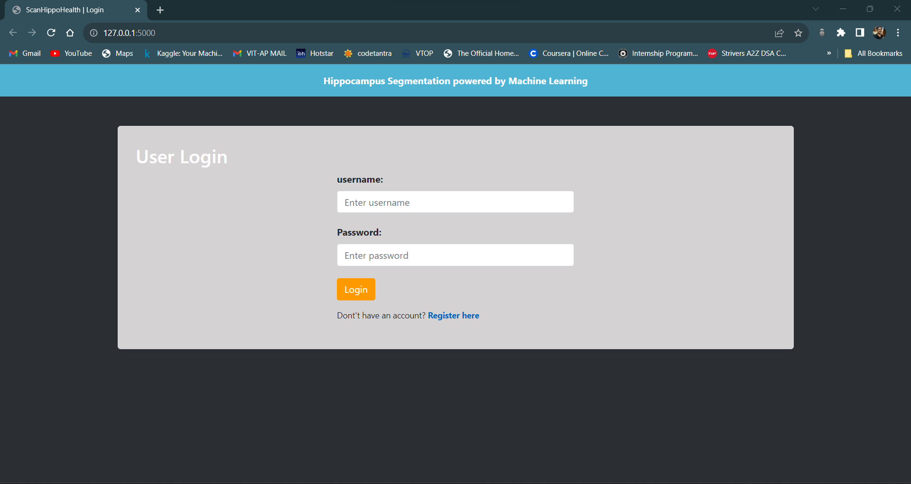

### Registration Page
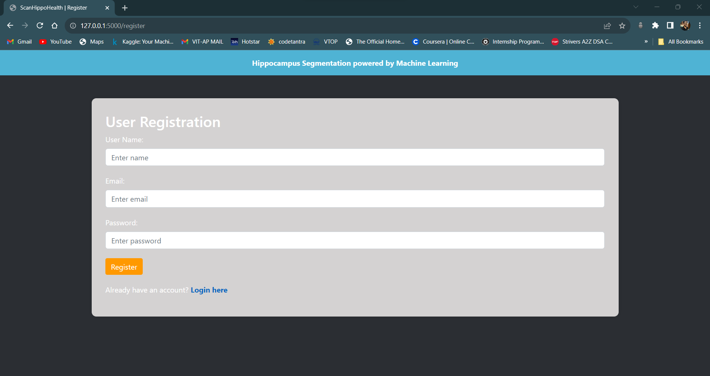

### Creating a User
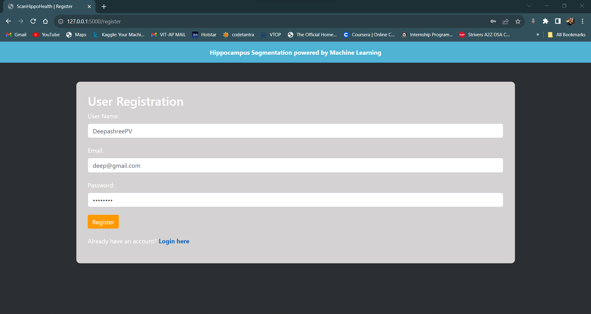

### Successfully Registered
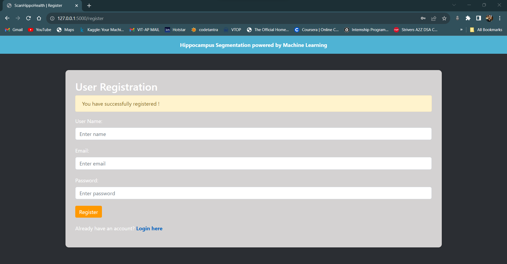

### Database After Registration
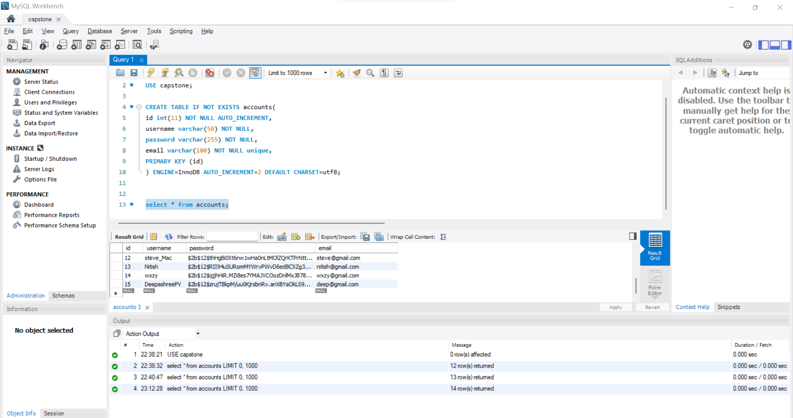

### Input Validation and User Validation in Login Page
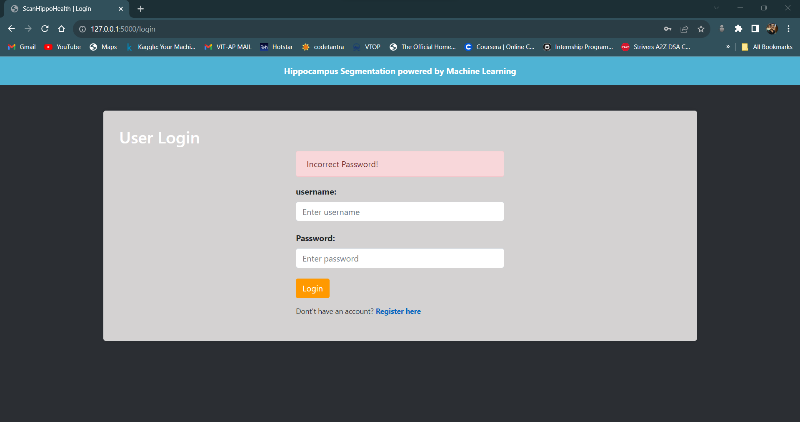

### Home Page of ScanHippoHealth
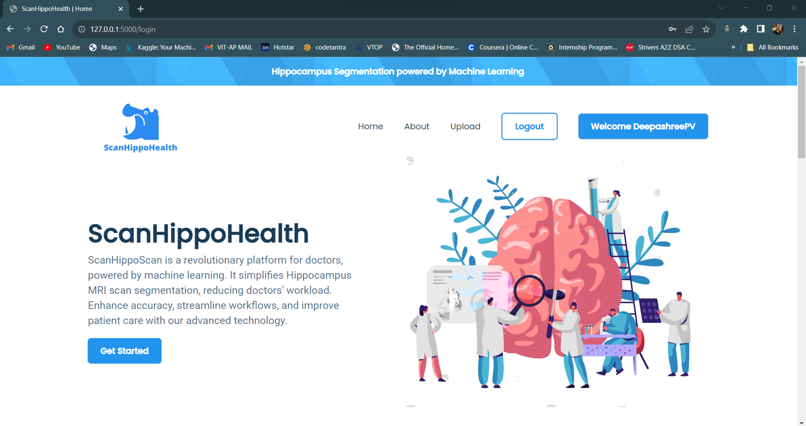

### About ScanHippoHealth (1)
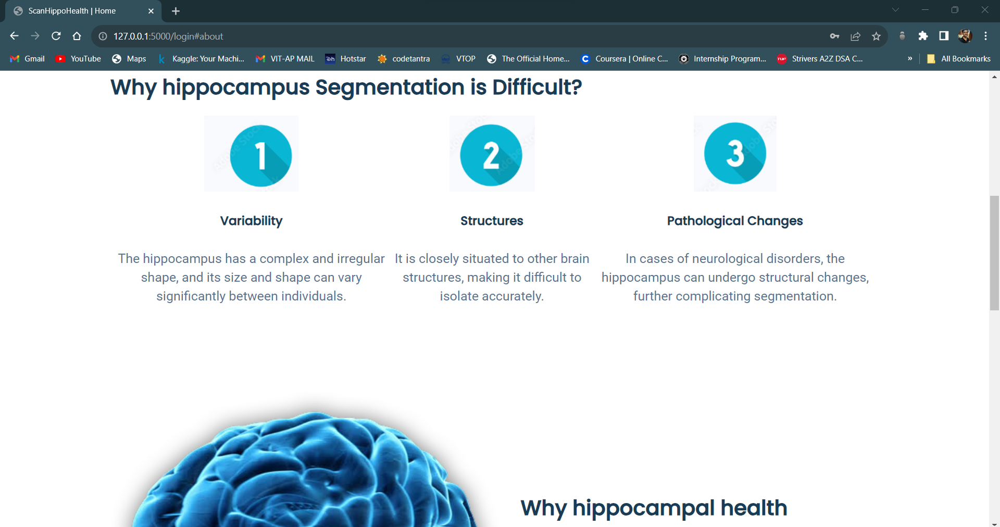

### About ScanHippoHealth (2)
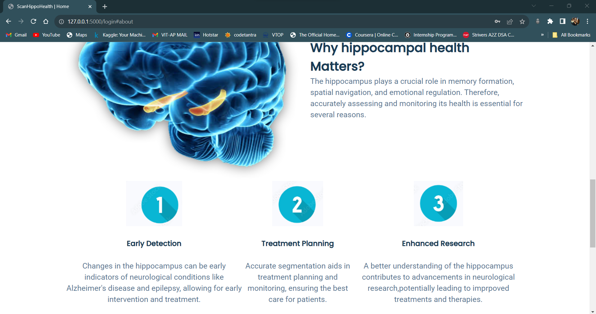

### Upload Option for MRI Image
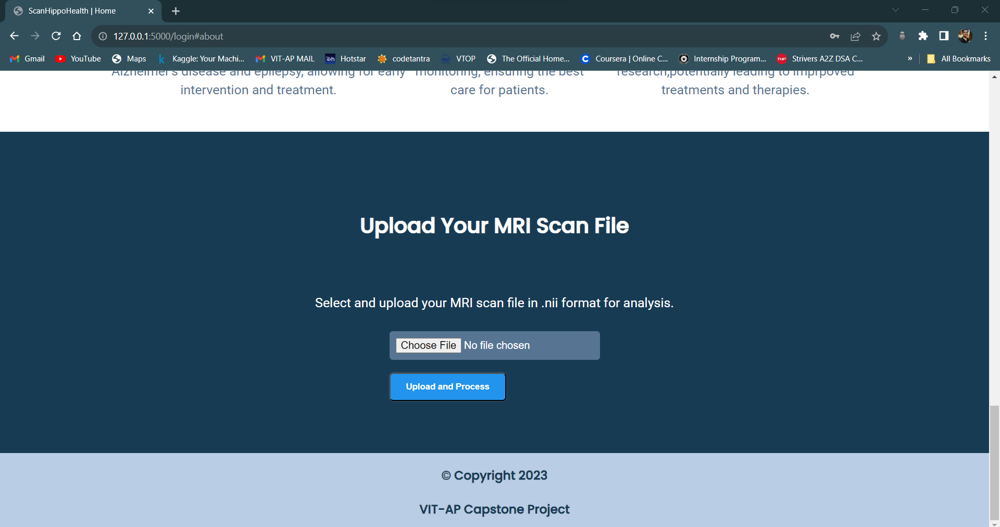

### Predicted Image and Mask Slices
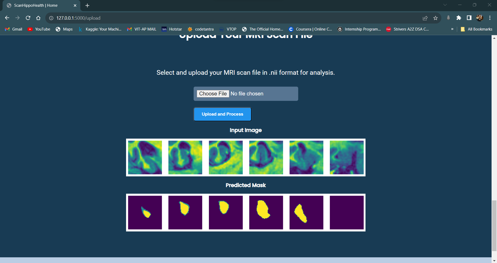

## Contributing 🤝

Contributions are welcome! Feel free to open issues or submit pull requests.

## License 🪪

This project is licensed under [MIT License](LICENSE).
