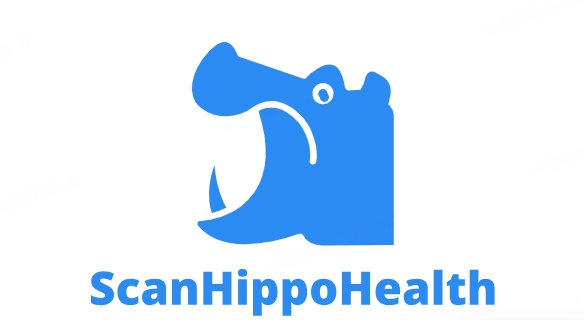

# ScanHippoHealth 🧠💊



ScanHippoHealth is a sophisticated MRI segmentation project specifically designed for the segmentation of the Hippocampus. The project utilizes the dataset provided by the [Medical Segmentation Decathlon](http://medicaldecathlon.com/) for Generalizable 3D Semantic Segmentation.

## Overview

The project employs a 3D-Unet architecture for accurate segmentation. The architecture diagram can be found at `screenshots/Segmentation Architecture.png`.

## Features 🚀

- **User Authentication:** Secure (Input Validations) login, logout, and registration functionalities are integrated.
- **Data Security:** User passwords are hashed and salted using the bcrypt library before storage in the MYSQL database.
- **MRI Segmentation:** Users can upload MRI images in `.nii.gz` format through the user-friendly Flask application.
- **Prediction and Visualization:** The model predicts the MRI images and displays six slices of the input image along with the corresponding mask. This aids in visualizing the segmentation results.

### How to Use 🔎

1. **Clone the Repository**

   ```bash
   git clone https://github.com/Sanjay71013/ScanHippoHealth-Medical-MRI-Segmentation.git
   ```

2. **Install Dependencies**

   ```bash
   pip install -r requirements.txt
   ```

3. **Run the Application**

   ```bash
   python app.py
   ```

## Screenshots 📸

### Login Page


### Registration Page


### Creating a User


### Successfully Registered


### Database After Registration


### Input Validation and User Validation in Login Page


### Home Page of ScanHippoHealth


### About ScanHippoHealth (1)


### About ScanHippoHealth (2)


### Upload Option for MRI Image


### Predicted Image and Mask Slices


## Contributing 🤝

Contributions are welcome! Feel free to open issues or submit pull requests.

## License 🪪

This project is licensed under [MIT License](LICENSE).

---

Feel free to tailor this template to fit your project's specific details and styling preferences.
